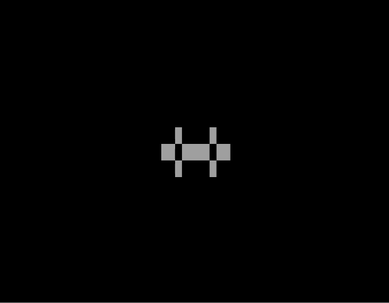

# GameOfLife.ASM
Conway's Game of Life in 8086 Assembly for DOS.

> //TODO: Read the initial pattern from a file.

> Pentadecathlon Oscillator:
> <br><br>

Assemble in DOS with MASM.
```
> MASM GOL.ASM
> LINK GOL.OBJ

> GOL.EXE
```